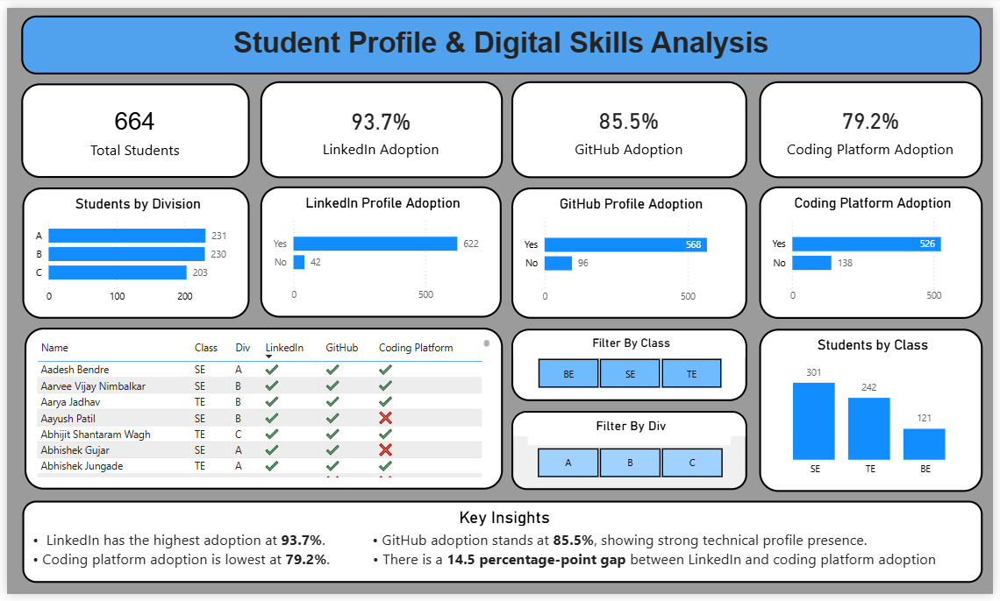

# Student Profile & Digital Skills Analysis

A Power BI dashboard created to analyze students professional and technical digital profiles.

## Dashboard

## About the Project

The goal of this project is to understand how students are using professional and coding platforms such as LinkedIn, GitHub, and coding platforms.

The dashboard allows users to:
- View overall student statistics
- Compare LinkedIn, GitHub and coding platform adoption
- Analyze students by class and division
- Filter the dashboard using class and division
- Check individual student profile status

## Tools Used

- Power BI
- Power Query
- DAX
- Excel

## Dataset

The dataset contains student information such as:

- Name
- Class
- Division
- LinkedIn
- GitHub
- Coding Platform

The data was cleaned and prepared using Power Query before creating the dashboard.

## Key Numbers

| Metric | Value |
|---|---:|
| Total Students | 664 |
| LinkedIn Adoption | 93.7% |
| GitHub Adoption | 85.5% |
| Coding Platform Adoption | 79.2% |

## Key Insights

- LinkedIn has the highest adoption at **93.7%**.
- GitHub adoption is **85.5%**.
- Coding platform adoption is the lowest at **79.2%**.
- There is a **14.5 percentage-point gap** between LinkedIn and coding platform adoption.
- SE has the highest number of students with **301 students**.

## Dashboard Features

- KPI cards
- Interactive class filter
- Interactive division filter
- Class-wise analysis
- Division-wise analysis
- Platform adoption analysis
- Student-level profile table
- Conditional formatting
- Key insights

## Project Structure

student-profile-powerbi/
│
├── README.md
├── Dashboard/
│   └── Students Profile Analysis.pbix
├── Dataset/
│   └── Contact Information (Responses).xlsx
└── Screenshots/
    └── dashboard.png

##  Future Enhancements

Possible future improvements include:

- Student profile completion score
- Placement-readiness analysis
- Skill-wise analysis
- Internship and certification tracking
- Placement outcome analysis
- Additional drill-through pages
- Automated data refresh
- Advanced DAX-based analytics

##  Dashboard

The final dashboard provides an interactive overview of student digital-profile adoption and allows users to explore the data using class and division filters.

## 👩‍💻 Author

**Khushi Nichang**

Aspiring Data Analyst | Power BI | SQL | Python | Excel

## Project Highlights

**Power BI Dashboard | Data Cleaning | Power Query | DAX | Data Visualization | Interactive Analytics**
   
